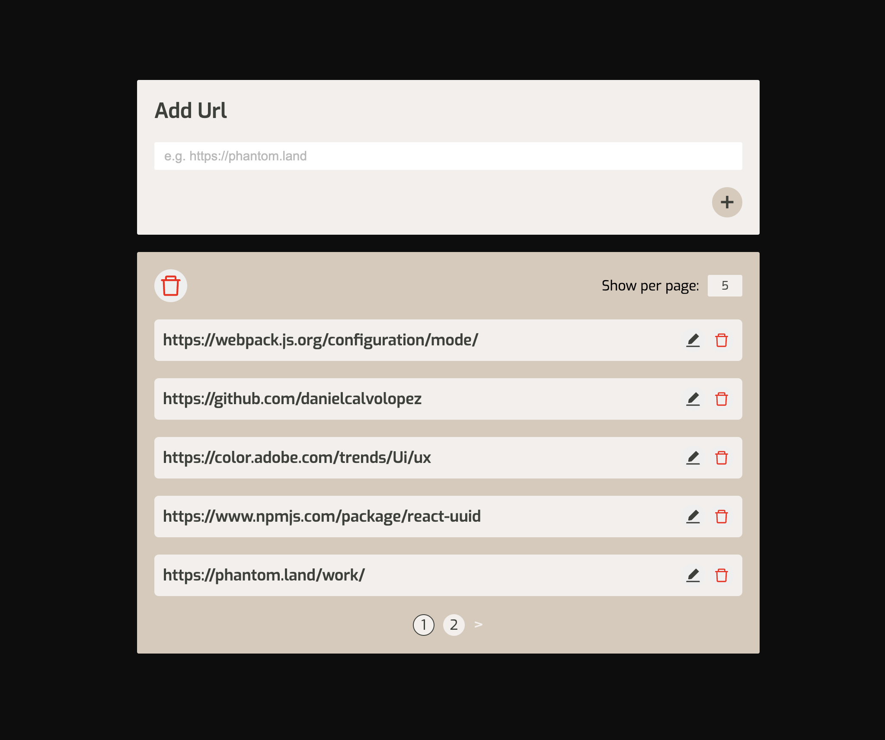
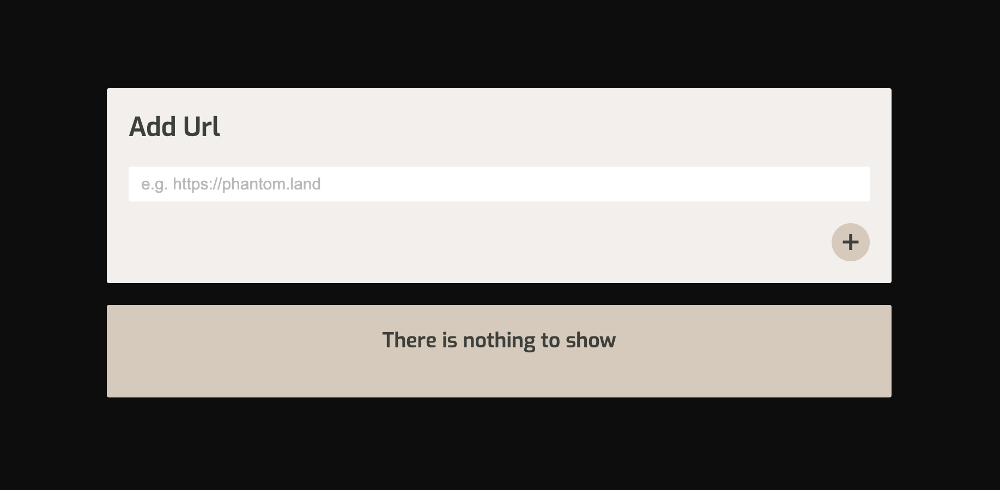

Phantom Test | Daniel Calvo

Install dependencies: npm install --global yarn
Start development mode: yarn run dev

Technologies used: React, TypeScript
Dependencies: react-uuid, react-icons

React hooks used:

useState to manage all the states within the app. useContext is in charge of feeding with most of the states related to the url list to the entire app, including add, remove, edit data, and identify when the form has errors.

Flow:

- The application displays a form at the top of the page that lets the user submit a link / url. The validation criteria is a correct url format and this should not be already on the list in order to be added.

- The display of the links is by default divided in pages of 20 url's. But I added a selector that allows the user to choose a different number of url's per page.

- The pagination includes number (that takes you to the page number on click) and arrows to go to previous or next pages.

- The user is able to remove any individual link or clear all.

My comments:

I approached this project thinking about composition, aiming to create small reusable components to be able to use them through the entire application, I have created a dedicated UI folder within the components folder to keep elements as localised as possible.

For styling I decided to use CSS modules for the same reason, keeping the style sheets isolated and avoid style conflicts.

You will find another folder called utils where constants, functions or data can be stored. In this case I created a file to store the pagination options in an array (5, 10, 20, 30) to be mapped and avoid hard coded elements.

A limitation we can potentially have with this approach, if the application grows, is that state management will require a more powerful tool such as Redux, useState and useContext are very handy for small / medium sized applications but not that recommended for large applications.

Design:

